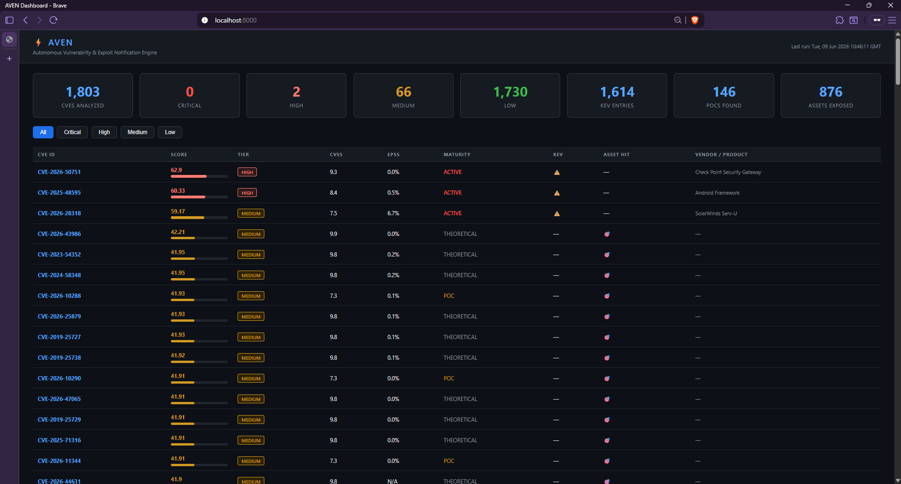
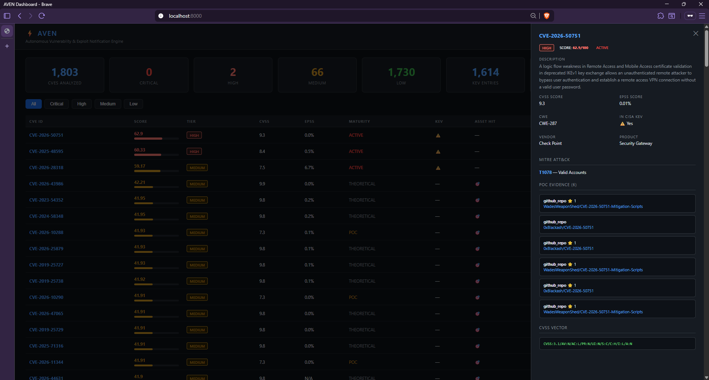
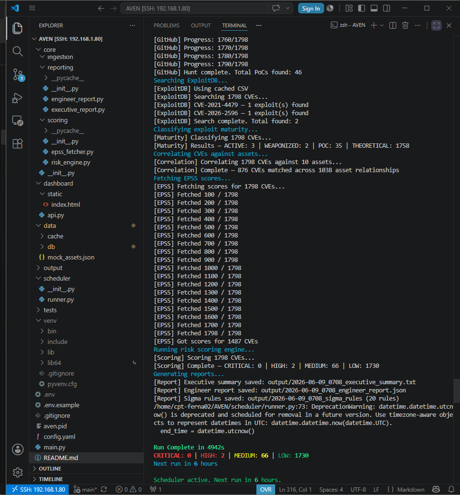

# ⚡ AVEN
### Autonomous Vulnerability & Exploit Notification Engine

[](https://python.org) [](LICENSE) []()

AVEN is a self-running vulnerability intelligence pipeline built for security
engineering teams who need more than a CVE feed. It continuously ingests
vulnerabilities from the National Vulnerability Database and CISA's Known
Exploited Vulnerabilities catalog, hunts public exploit repositories for
proof-of-concept evidence, and scores every CVE through a custom
multi-factor prioritization model. The output is a live risk dashboard,
auto-generated Sigma detection rules, and Slack alerts — all running on a
6-hour autonomous schedule without human intervention.

This project was built from scratch as a capstone security engineering
portfolio project. Every component — the scoring engine, the hunting logic,
the correlation system — was designed and implemented by hand. No pre-built
vulnerability management frameworks were used.

---

## Dashboard Preview

> The live risk dashboard showing 1,803 CVEs analyzed, scored, and tiered in real time. Each row shows a CVE's custom risk score, tier, CVSS, EPSS probability, exploit maturity level, KEV status, and affected assets.



---

## Why AVEN Exists

Security teams are drowning in CVEs. The NVD publishes hundreds of new
vulnerabilities every week, but CVSS scores alone are a poor triage signal.
A CVSS 9.8 with no public exploit and no asset exposure is less urgent than
a CVSS 7.0 that's in CISA's KEV list, has a weaponized PoC on GitHub, and
affects three production servers.

AVEN was built to solve that gap. It combines exploit intelligence,
exploitation probability, asset context, and confirmed in-the-wild activity
into a single prioritized risk score, so security engineers spend time on
the vulnerabilities that actually matter.

---

## Architecture

```
┌─────────────────────────────────────────────────────────────────┐
│                        AVEN Pipeline                            │
│                                                                 │
│  NVD API ──────────┐                                            │
│  CISA KEV ─────────┤                                            │
│  GitHub Search ────┼──▶ Ingestion ──▶ Hunting ──▶ Maturity     │
│  ExploitDB ────────┤                              Classifier    │
│  EPSS API ─────────┘                                  │         │
│                                                       ▼         │
│  Asset Inventory ──────────────────────▶ Scoring Engine         │
│                                                  │              │
│                              ┌───────────────────┤              │
│                              ▼                   ▼              │
│                         Dashboard          Reports +            │
│                         (FastAPI)          Sigma Rules          │
│                              │                   │              │
│                              └────────┬──────────┘              │
│                                       ▼                         │
│                                 Slack Alerts                    │
│                                                                 │
│  Scheduler (every 6 hours) ──▶ Runs entire pipeline             │
└─────────────────────────────────────────────────────────────────┘
```

---

## The Scoring Engine

The centerpiece of AVEN is a custom multi-factor risk prioritization model.
Each CVE receives a score from 0 to 100 calculated across five weighted
factors:

| Factor              | Weight | Source             | Rationale                               |
| ------------------- | ------ | ------------------ | --------------------------------------- |
| CVSS Base Score     | 30%    | NVD                | Established severity baseline           |
| EPSS Probability    | 25%    | FIRST.org          | Exploitation likelihood in next 30 days |
| Exploit Maturity    | 25%    | GitHub / ExploitDB | Actual attacker capability              |
| CISA KEV Membership | 10%    | CISA               | Confirmed in-the-wild exploitation      |
| Asset Exposure      | 10%    | Internal inventory | Environmental context                   |

**Exploit Maturity** is classified into four levels based on public evidence:

| Level         | Definition                                                   |
| ------------- | ------------------------------------------------------------ |
| `THEORETICAL` | CVE exists, no public exploit found                          |
| `POC`         | Proof-of-concept code found on GitHub or ExploitDB           |
| `WEAPONIZED`  | Multiple PoC sources or high star count — actively developed |
| `ACTIVE`      | Listed in CISA KEV — confirmed exploited in the wild         |

Final scores map to risk tiers: **CRITICAL** (≥80), **HIGH** (60–79), **MEDIUM** (40–59), **LOW** (<40).

The weights are fully configurable in `config.yaml`. This was a deliberate
design decision — different organizations have different risk tolerances, and
a financial institution will weight asset exposure differently than a startup.

---

## What AVEN Produces

**Executive Report** — Plain-language summary of top vulnerabilities with
remediation priority guidance. Designed to be readable by non-technical
stakeholders. Generated as a timestamped text file every run.

**Engineer Report** — Full technical JSON output for each high-priority CVE:
CVSS vector, EPSS probability, MITRE ATT&CK mapping, PoC evidence with
links, affected assets, and scoring breakdown.

**Sigma Rules** — Auto-generated detection rules in valid Sigma YAML format
for every high-priority CVE, mapped to MITRE ATT&CK techniques, ready to
import into any compatible SIEM (Splunk, Elastic, Wazuh, Chronicle).

**Live Dashboard** — Web interface showing real-time risk scores, tier
breakdown, CVE detail panel with PoC links and asset matches, MITRE
mappings, and run history.

> Clicking any CVE opens a full detail panel showing the score breakdown, MITRE ATT&CK technique, PoC repository links, CVSS vector, and CISA KEV confirmation — everything needed to triage and act.



**Slack Alerts** — Fires to a configured channel on every pipeline run with
a summary and individual alerts for new CRITICAL and HIGH CVEs.

---

## Project Structure

```
AVEN/
├── core/
│   ├── ingestion/          # NVD + KEV fetchers, SQLite schema
│   ├── hunting/            # GitHub hunter, ExploitDB hunter, maturity classifier
│   ├── scoring/            # EPSS fetcher, risk scoring engine
│   ├── correlation/        # Asset correlator
│   └── reporting/          # Executive report, engineer report, Sigma generator
├── scheduler/              # Autonomous run loop (schedule library)
├── dashboard/              # FastAPI backend + single-file HTML frontend
├── alerts/                 # Slack webhook integration
├── data/
│   ├── mock_assets.json    # Asset inventory
│   └── db/aven.db          # SQLite database
├── output/                 # Timestamped reports and Sigma rules per run
├── config.yaml             # All configuration in one place
├── main.py                 # Single-run entry point
└── requirements.txt
```

---

## Quick Start

```bash
git clone https://github.com/cpt-ferna02/AVEN.git
cd AVEN
python3 -m venv venv
source venv/bin/activate
pip install -r requirements.txt
cp .env.example .env
# Fill in NVD_API_KEY and GITHUB_TOKEN in .env
python3 main.py
```

**Run the dashboard:**

```bash
python3 dashboard/api.py
# Open http://localhost:8000
```

**Run autonomously:**

```bash
nohup python3 scheduler/runner.py > output/aven.log 2>&1 &
```

---

## Configuration

All settings live in `config.yaml`:

| Setting                            | Default | Description                           |
| ---------------------------------- | ------- | ------------------------------------- |
| `nvd.days_back`                    | 7       | Days of CVE history to ingest per run |
| `scheduler.run_every_hours`        | 6       | Pipeline run interval                 |
| `scoring.weights.cvss`             | 0.30    | CVSS component weight                 |
| `scoring.weights.epss`             | 0.25    | EPSS component weight                 |
| `scoring.weights.exploit_maturity` | 0.25    | Maturity component weight             |
| `scoring.weights.kev_bonus`        | 0.10    | KEV membership bonus                  |
| `scoring.weights.asset_exposure`   | 0.10    | Asset match bonus                     |

---

## Environment Variables

```
NVD_API_KEY=        # Free at nvd.nist.gov/developers/request-an-api-key
GITHUB_TOKEN=       # Personal access token, public_repo scope only
SLACK_WEBHOOK_URL=  # Optional — incoming webhook URL for alerts
```

---

## Engineering Challenges & How They Were Solved

Building AVEN involved several real engineering problems that required
diagnosis and deliberate fixes. These are documented here because they
reflect how the system actually works, not just how it was designed.

**NVD Rate Limiting and Infinite Loop** — The initial NVD fetcher had a pagination loop that, when it hit a 429 rate
limit response, would fail to advance the page index and loop on the same
offset indefinitely. The fix required adding a retry mechanism with
exponential backoff (30s, 60s, 90s) and a hard break condition when retries
were exhausted. The fetcher now handles rate limits gracefully and resumes
correctly.

**GitHub Token Not Loading** — After setting API keys in `.env`, both the NVD key and GitHub token were
returning NOT FOUND at runtime. Root cause was that the `.env` file had been
accidentally committed to git and then deleted during the cleanup process,
leaving the file missing on disk entirely. Resolved by recreating the file
and verifying key loading with a targeted Python test before proceeding.

**Secret Exposure and Git History Rewrite** — The GitHub token was accidentally committed inside `.env` during an early
push. GitHub's push protection correctly blocked the push. The token was
immediately revoked, a new one generated, and the commit history was
rewritten using `git filter-branch` to scrub the secret from all historical
commits before force-pushing the clean history.

**Duplicate Score Rows** — The scores table was producing duplicate rows per CVE on every run because `INSERT OR REPLACE` requires a UNIQUE constraint on the target column to
function as an upsert. Without it, SQLite treats every insert as a new row.
Fixed by adding `UNIQUE` to the `cve_id` column in the scores table schema
and recreating the database.

**Database Schema Syntax Error** — During a schema update, a malformed column definition (`cve_id TEXT UNIQUE, PRIMARY KEY`) caused a SQLite syntax error that prevented the database from
initializing. Fixed by understanding that `PRIMARY KEY` already implies
uniqueness in SQLite — the two constraints are mutually exclusive on the
same column.

**`save_cves` Nested Inside `fetch_recent_cves`** — When replacing the NVD fetcher function, the `save_cves` function was
accidentally pasted inside `fetch_recent_cves` rather than at the module
level. Python raised a `NameError` at runtime because the nested function
was unreachable from the call site. Fixed by rewriting the entire file
cleanly using a heredoc to avoid indentation ambiguity.

**venv Committed to Git** — The Python virtual environment directory was committed on the first push,
inflating the repository to 28MB. Removed using `git rm -r --cached venv/` and added `venv/` to `.gitignore`. A subsequent push of the filter-branch
rewrite re-introduced it, requiring a second removal pass.

---

## Real Data, Real Results

On a typical 7-day run AVEN processes:

- ~1,600–1,800 CVEs from NVD
- ~1,600 KEV entries from CISA
- GitHub PoC hunting across all CVEs with 2s rate-limit-safe spacing
- Full ExploitDB CSV cross-reference
- EPSS scores for every CVE via FIRST.org batch API
- Asset correlation across 10 mock enterprise assets
- Auto-generated Sigma rules for every MEDIUM+ CVE

> A full autonomous pipeline run via SSH — showing GitHub PoC hunting, ExploitDB cross-reference, exploit maturity classification, asset correlation, EPSS scoring across 1,798 CVEs, and the final risk scoring output. The scheduler confirms the next run in 6 hours.



Sample output from a live run:

```
CRITICAL: 0 | HIGH: 2 | MEDIUM: 66 | LOW: 1,730
CVEs: 1,803 | KEV: 1,614 | PoCs Found: 146 | Assets Exposed: 876
```

Top-scored CVE from that run: CVE-2026-50751 (Check Point Security Gateway)
— CVSS 9.3, ACTIVE maturity, CISA KEV confirmed, 6 GitHub PoC repositories,
MITRE T1078 (Valid Accounts). Score: 62.9/100.

---

## Stack

| Component     | Technology                        |
| ------------- | --------------------------------- |
| Language      | Python 3.10+                      |
| Database      | SQLite (via stdlib sqlite3)       |
| API Backend   | FastAPI + Uvicorn                 |
| Frontend      | Vanilla HTML/CSS/JS               |
| Scheduling    | schedule library                  |
| CVE Data      | NVD REST API v2                   |
| KEV Data      | CISA JSON feed                    |
| Exploit Intel | GitHub Search API + ExploitDB CSV |
| EPSS Data     | FIRST.org API                     |
| Alerts        | Slack Incoming Webhooks           |

---

## Roadmap

- [ ] CPE-based asset matching for higher-precision correlation
- [ ] Metasploit module detection as a maturity signal
- [ ] Email alert channel via SMTP
- [ ] Docker deployment with compose file
- [ ] Historical trend tracking — score delta between runs
- [ ] Nuclei template auto-generation for validated CVEs

---

## About the Author

Built by Fernando Cortez as a capstone security engineering portfolio
project. Targeting Security Engineer roles with a focus on vulnerability
intelligence, detection engineering, and security automation.

[GitHub](https://github.com/cpt-ferna02)
